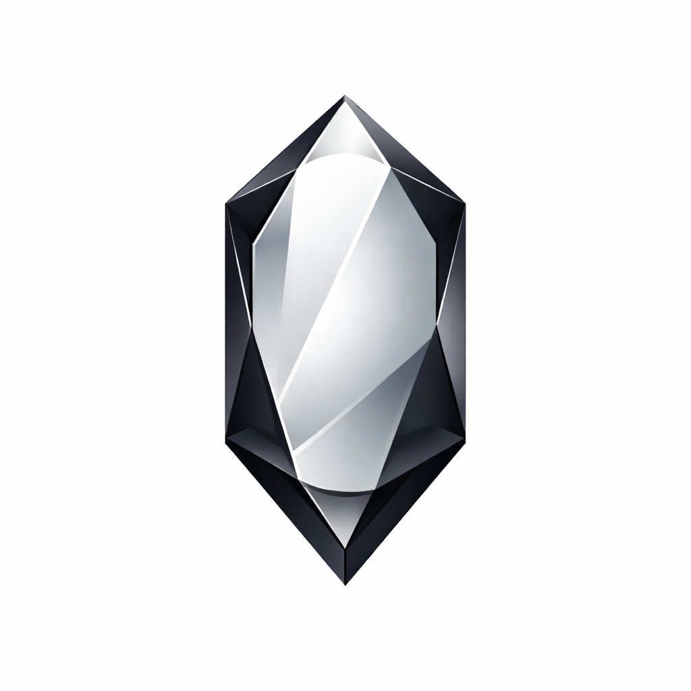

<div align="center">



# Nexi

### All AI in One Place

*40+ world-class AI models in a single, beautifully designed iOS app*

---

[](https://apple.com/ios)
[](https://swift.org)
[](https://apps.apple.com)

</div>

---

## What is Nexi?

**Nexi** is an iOS app that puts every major AI model right in your pocket. Chat with Google Gemini, OpenAI GPT, Anthropic Claude, Meta Llama, Mistral, and 35+ more — all from a single, unified interface. No switching apps, no juggling subscriptions, no friction.

One app. All AI.

---

## Features

- **40+ AI Models** — Switch between models from Google, OpenAI, Anthropic, Meta, Mistral, Qwen, and more with a single tap
- **Vision** — Send photos directly from your camera roll or camera for analysis by vision-capable models
- **Encrypted Chat History** — All your conversations are encrypted and synced securely to the cloud
- **Sign in with Apple / Google** — Fast, private authentication with no passwords required
- **Email Sign-In** — Passwordless 6-digit code login for any email address
- **Subscription Plans** — Free, Basic, and Premium tiers managed through the App Store
- **Smart Quotas** — Daily request limits that reset automatically; Premium users get unlimited text chats
- **Avatar & Profile** — Personalize your profile with a custom photo

---

## AI Models

| Provider | Models |
|---|---|
| **Google** | Gemini 3 Pro, Gemini 2.5 Flash, Gemini 2.0 Flash, Gemma series |
| **OpenAI** | GPT-4o, GPT-4o mini, GPT-4.1 mini |
| **Anthropic** | Claude Opus 4.6, Claude Sonnet 4.6 |
| **Meta** | Llama 3.2 Vision, Llama 4 Scout, Llama 4 Maverick |
| **Mistral** | Mistral Large, Pixtral 12B |
| **Qwen** | Qwen 3, Qwen 2.5 Vision, Qwen VL |
| **Others** | Kimi, NVIDIA Nemotron, Reka Flash, GLM-4, Seed-Vision |

---

## Subscription Plans

| Feature | Free | Basic | Premium |
|---|:---:|:---:|:---:|
| Daily text chats | 10 | 25 | Unlimited |
| Image requests / day | 1 | 3 | 15 |
| Access to all 40+ models | ✓ | ✓ | ✓ |
| Encrypted chat history | ✓ | ✓ | ✓ |
| Vision (send images) | ✓ | ✓ | ✓ |

> Quotas reset daily at midnight. Premium subscribers never hit a text request limit.

---

## Privacy & Security

- **Encrypted messages** — Every chat message is encrypted before it ever touches the server
- **Sign in with Apple** — Your email stays private; Apple handles authentication
- **No password storage** — Authentication is fully delegated to Apple, Google, or a one-time email code
- **Secure tokens** — Short-lived access tokens with automatic silent refresh

---

## Project Structure

```
nexi-ios/
├── App/
│   ├── NexiApp.swift
│   └── ContentView.swift
├── Features/
│   ├── Auth/               # Sign in with Apple / Google / Email
│   ├── Chat/               # Chat view, message list, input bar
│   ├── Models/             # Model picker & switcher
│   ├── Vision/             # Image attachment & preview
│   ├── Profile/            # Avatar, subscription, settings
│   └── Billing/            # App Store purchases & validation
├── Services/
│   ├── APIClient.swift     # Signed API requests
│   ├── AuthService.swift   # Token management & refresh
│   └── ImageService.swift  # Upload & CDN
└── Resources/
    ├── Assets.xcassets
    └── Localizable.strings
```

---

<div align="center">

Built with love for **iOS** · Powered by **OpenRouter** · Secured by **Apple**

*Nexi — All AI in One Place*

</div>
